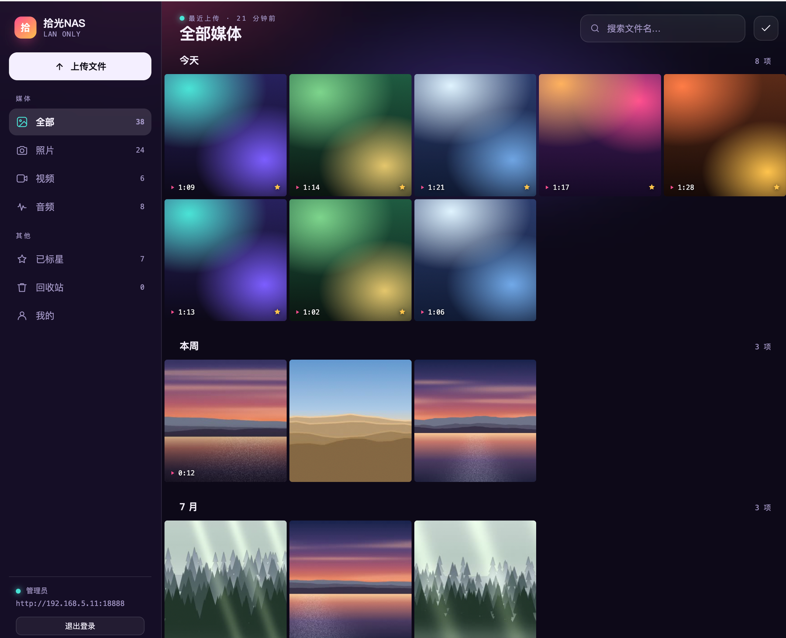
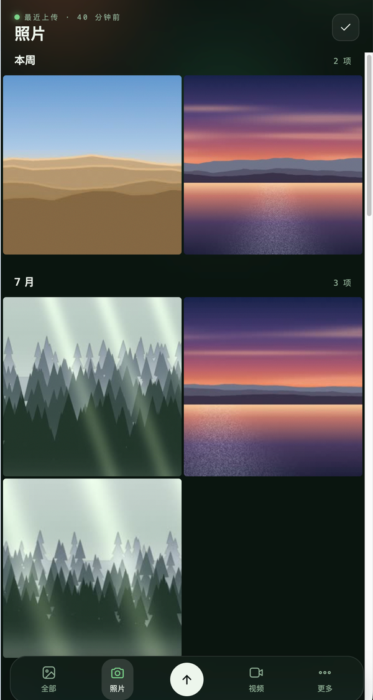
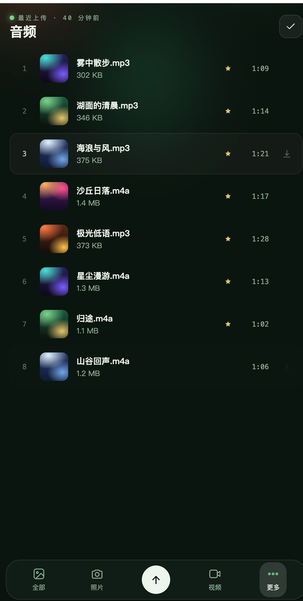
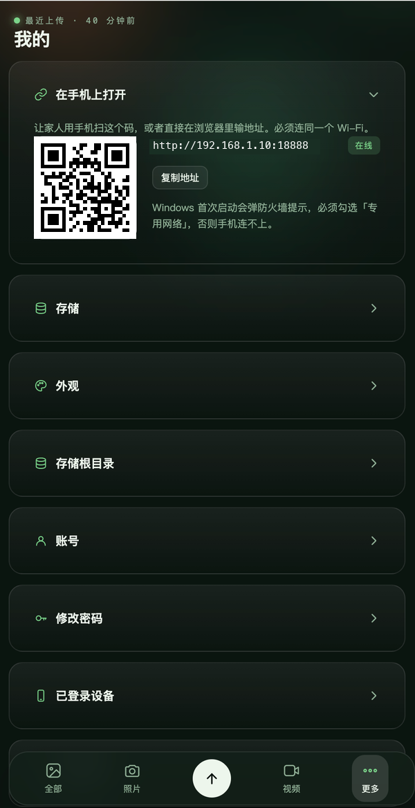

# 拾光 NAS

> **拾光**——拾取逝去的时光。

时光不会倒流，但快门按下的那一瞬，它留下了一点影子。

一次没来得及看完的日落，一个还不会走路的背影，一段已经想不起当时在笑什么的录像。
这些碎片散落在换过三四部的旧手机里，散落在再也打不开的云盘链接里，
散落在"存储空间不足"的红色提示后面——它们还在，只是你找不回来了。

拾光 NAS 想做的事很朴素：**把它们收回来，放在你自己家里那台机器上。**

不联外网，不传云端，东西就在你自己手边。一个包，双击启动。
家里人连上同一个 Wi-Fi，就能一起翻。

照片按拍摄那天自动归拢，于是滑动本身成了一条时间的河——
今天、本周、七月、去年的某个傍晚。你不是在管理文件，你是在往回走。



---

## 你的照片不会离开这台机器

云相册很方便，但方便是有前提的：服务要一直在，套餐要一直续，账号要一直正常。
任何一环松动，照片就隔在了门外——而它们本来就是你的。

拾光 NAS 把这件事反过来——**照片存在你家里那台机器的硬盘上，仅此一处。**

- **不上云**。没有任何服务器接收你的文件，因为压根没有服务器。
  程序不主动连接外网，没有遥测、没有账号体系、没有"同步"这回事。
- **只在局域网**。要看照片，得先连上你家的 Wi-Fi。人在外面就是看不了——
  这是刻意的：没有公网入口，就没有公网上的攻击面。
- **前端不引任何 CDN**。字体、图标、脚本全部自托管，浏览器的内容安全策略
  锁死为 `default-src 'self'`——就算某天有人往里注入了一段脚本，
  它也没有任何一个能把照片发出去的出口。

### 局域网也不等于可以裸奔

合租的房子、公司的办公网、宿舍的 Wi-Fi——同一个网段里的人未必都是家人。
所以该做的一样没省：

| 面向的风险 | 做法 |
|---|---|
| 密码 | bcrypt（代价因子 12），明文和可逆密文都不落盘 |
| 暴力破解 | 按 IP 和用户名**双维度**限流，指数退避，第 5 次就锁 |
| 用户名枚举 | 账号不存在时也照样跑一次哈希，失败文案完全相同，时序上看不出差别 |
| 会话 | HttpOnly + SameSite=Strict Cookie，登录后换新会话 ID 防会话固定 |
| 照片链接 | 每个缩略图和原图都是 HMAC 签名 URL，带有效期，改一个字节就失效 |
| 仿冒管理员 | 用户名只允许 ASCII——防止用西里尔字母 `а` 冒充拉丁字母 `a` |
| 数据目录 | 权限收紧到仅当前用户可读写（Unix `700`/`600`，Windows 独占 ACL） |
| 来源 IP | 不读 `X-Forwarded-For`——没有反向代理，读了等于让人随便伪造来源 |

想更进一步，可以一行命令开 HTTPS（见下面「加密传输」），
连同一个 Wi-Fi 下的抓包也一起挡掉。

这些不是写在文档里就算数的。仓库里有一套 121 项的对抗性测试
（`tools/security-check.py`），覆盖越权访问、SQL 注入、路径穿越、
签名伪造与重放、XSS、CSRF、用户名枚举、错误信息泄露等，每次改动都要跑通。

---

## 快速开始

1. 从 [Releases](../../releases) 下载对应平台的包，解压
2. 双击启动器
   - Windows：`ShiguangNAS.exe`
   - macOS：`ShiguangNAS.app`
   - Linux：`ShiguangNAS/bin/ShiguangNAS`
3. 浏览器自动打开，用 **`admin` / `admin`** 登录
4. 系统会**强制你先改一个复杂密码**
5. 控制台会打印局域网地址（形如 `http://192.168.1.10:18888`），手机浏览器打开它，
   或者在「我的」页面扫二维码

<p align="center">
  
  
  
</p>

> **Linux 用户注意**：包里带了 ffmpeg，但它链接了系统的音频/图形库。
> 精简过的服务器镜像上如果启动后缩略图一直生不出来，装一下就好：
>
> ```bash
> sudo apt install libasound2t64 libpulse0 libxcb1 libxcb-shm0   # Debian / Ubuntu
> sudo dnf install alsa-lib pulseaudio-libs libxcb               # Fedora / RHEL
> ```

### 首次启动要注意的三件事

**Windows 防火墙**——首次启动会弹提示，**必须勾选「专用网络」**。
不勾的话本机能访问，手机一定连不上。
事后补救：控制面板 → Windows Defender 防火墙 → 允许应用通过防火墙 → 找到 ShiguangNAS → 勾上「专用」。

**初始密码是公开的**——`admin` / `admin` 谁都猜得到。在你改掉之前，同局域网的人也能登进来。
所以**先启动、先改密码、再接入局域网**。

好在这个窗口里闯进来的人干不了什么：密码没改之前，服务端会拒绝除「改密码」之外的所有接口，
他既翻不了照片，也改不了任何设置。

**系统会拦未签名的程序**——项目还没买代码签名证书（macOS 公证要 99 美元/年）：

- macOS：提示"无法验证开发者"。右键点 `.app` → 打开 → 再点打开。
  或者 `xattr -dr com.apple.quarantine ShiguangNAS.app`
- Windows：SmartScreen 蓝屏提示。点「更多信息」→「仍要运行」

---

## 能做什么

**上传**——点「上传文件」或把文件拖进窗口，手机上点底部那个圆按钮。
大文件自动分片，中途断网可以接着传；传过的文件秒传，一个字节都不重传。

支持 iPhone 的 HEIC 照片和 HEVC 视频，以及常见的 JPEG / PNG / GIF / WebP / MP4 / MOV /
MKV / MP3 / M4A / FLAC / WAV 等。

**浏览**——照片读取 EXIF 里的拍摄时间，按那一天分组铺成网格（手机上两列大图），
滑到底自动加载下一批。点开是大图预览，左右滑动或方向键翻页。
视频点开只播这一个，不会一不留神滑到别的去。音频是列表，点了在底部出播放条。

**整理**——标星、批量选择、删除到回收站。回收站里的东西 30 天后自动清掉，
在那之前随时能恢复。

**搜索**——按文件名搜，中文可以搜任意位置的片段（搜「日落」能找到「海边日落.jpg」）。

**账号**——`admin` 是这台机器上唯一的管理员。他在「我的」里新建家人的账号、
重置任何人的密码、停用某个账号。没有自助注册，也没有邀请码。
每个人都能看到自己的登录设备，把可疑的踢下线。

**换肤**——六套配色（星云 / 深海 / 石墨 / 苔藓 / 纯黑 / 日光），存在各自的设备上，
家里每个人可以各选各的。网格密度和是否显示文件名也能调。

**存储位置**——管理员在「我的 → 存储根目录」里能看到当前路径、磁盘剩余空间和目录结构，
也能改到别的盘。改完需要重启生效，**旧文件要自己搬过去**——几百 GB 的跨盘复制
中途断电就毁了，交给你用文件管理器搬更稳妥。

---

## 数据存在哪

| 内容 | 位置 |
|---|---|
| 媒体文件、缩略图、数据库、日志 | Windows：剩余空间最大的固定盘根目录下的 `ShiguangNAS\`<br>macOS / Linux：`~/ShiguangNAS/` |
| 配置和实例密钥 | Windows：`%LOCALAPPDATA%\ShiguangNAS\`<br>macOS：`~/Library/Application Support/ShiguangNAS/`<br>Linux：`~/.config/ShiguangNAS/` |

存储位置在首次启动时探测一次并写进配置文件，之后不会再变——插拔移动硬盘不会让照片"跑掉"。
想换位置就改配置目录里 `config.properties` 的 `storage.root`，再把旧目录整个搬过去。

这些目录的权限被收紧到仅当前用户可读写（Unix 是 `700`/`600`，Windows 是独占 ACL）。

### 忘记密码怎么办

没有找回渠道——这是个不联网的私有服务，做找回意味着开一个新的攻击面。
只能删掉数据目录里的 `db/shiguang.db` 重新初始化。
**媒体文件不会丢**，但账号、标星、回收站记录会没。

---

## 加密传输（可选，共享网络里建议开）

默认走 HTTP。**局域网不等于可信网络**——合租、公司、宿舍的 Wi-Fi 里，
任何人抓一个包就能拿到会话 Cookie 并接管账号。

```bash
java -jar shiguang-nas.jar --shiguang.tls.enabled=true
```

首次启动自动生成一张自签证书（EC P-256，有效期 825 天，临期自动重签），
SAN 里包含 `localhost`、`127.0.0.1` 和全部局域网 IP。

代价是浏览器会警告「连接不是私密连接」——这是自签证书的正常表现。
想一劳永逸：登录后访问 `/api/system/certificate` 下载证书装进系统信任列表。
iOS 上还要去「设置 → 通用 → 关于本机 → 证书信任设置」里手动打开开关。

---

## 技术

| 层 | 选型 |
|---|---|
| 后端 | Spring Boot 4 · Java 21 虚拟线程 · SQLite |
| 前端 | Vue 3 · TypeScript · Vite |
| 打包 | jpackage —— 把 JRE 一起塞进包里，所以用户不需要装 Java |
| 多媒体 | ffmpeg —— 缩略图、封面帧、HEIC/HEVC 解码、元数据都靠它 |

运行时依赖只有三个：SQLite 驱动、ffmpeg 和它的加载器。
限流、二维码、数据库迁移、EXIF 解析、参数校验这些都是自己写的几十行，没有引框架。
密码用 bcrypt（代价因子 12），登录失败按 IP 和用户名双维度限流。

从源码构建需要 JDK 21+、Node 22+、Maven 3.9+：

```bash
./packaging/jpackage.sh                                          # 当前平台的绿色包
powershell -ExecutionPolicy Bypass -File packaging\jpackage.ps1  # Windows
```

`jpackage` 不能交叉编译，每个平台的包必须在对应平台上构建。
`.github/workflows/release.yml` 用 matrix 产出五个包：

| 平台 | 产物 |
|---|---|
| Windows x64 | `ShiguangNAS-<ver>-windows-x86_64.zip` |
| macOS Apple Silicon | `ShiguangNAS-<ver>-darwin-arm64.zip` |
| macOS Intel | `ShiguangNAS-<ver>-darwin-x86_64.zip` |
| Linux x64 | `ShiguangNAS-<ver>-linux-x86_64.tar.gz` |
| Linux ARM64 | `ShiguangNAS-<ver>-linux-arm64.tar.gz` |

<details>
<summary>开发时分开跑</summary>

```bash
# 后端（用隔离的数据目录，别污染真实 home）
mvn spring-boot:run -Dspring-boot.run.jvmArguments="-Duser.home=/tmp/sgtest"

# 无头模式（服务器上跑，不要托盘和自动开浏览器）
mvn spring-boot:run -Dspring-boot.run.arguments="--shiguang.open-browser=false --shiguang.tray.enabled=false"

# 前端热更新，5173 端口，API 代理到 18888
cd frontend && npm install && npm run dev

mvn test                      # 单元测试
mvn -Psecurity-scan verify    # 依赖漏洞扫描

# 安全测试。务必对着一次性实例跑——它会建账号、传文件、把登录打到限流
java -Duser.home=/tmp/sgsec -jar target/shiguang-nas.jar --server.port=8081 \
     --shiguang.open-browser=false --shiguang.tray.enabled=false &
SG_HOME=/tmp/sgsec python3 tools/security-check.py
```

前端构建产物直接输出到 `src/main/resources/static/`，随 jar 一起分发，没有独立的前端部署。
</details>

---

<p align="center"><sub>照片会褪色，硬盘会老去，但它们至少在你自己手上。</sub></p>
